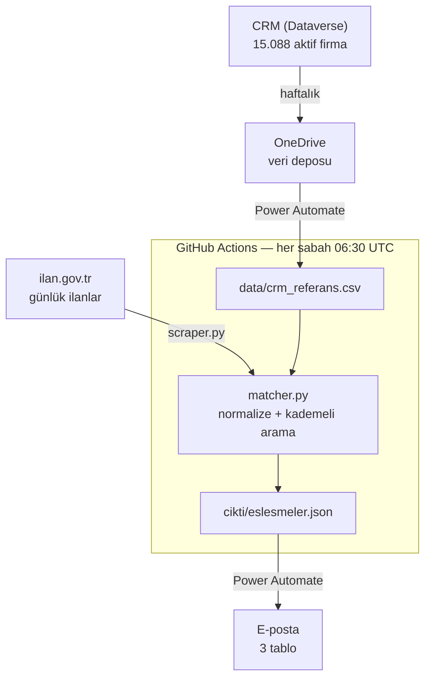

# Konkordato Takip Sistemi

ilan.gov.tr'de yayımlanan konkordato ilanlarını her gün tarar, CRM'deki müşteri
firmalarla eşleştirir ve eşleşme bulunduğunda e-posta uyarısı gönderir.

Amaç: bir müşterinin finansal zorluğa girdiğini ilan yayımlandığı gün öğrenmek.

---

## Mimari



Üç katman, üç ayrı sorumluluk:

| Katman | İş | Neden orada |
|---|---|---|
| **GitHub Actions** | Tarama, eşleştirme, skorlama | Hesaplama hızlı ve test edilebilir olmalı |
| **Power Automate** | Dataverse'ten veri çekme, e-posta | Kurumsal bağlantılar hazır, ek kayıt gerekmiyor |
| **OneDrive** | CRM verisinin kalıcı kopyası | Veri şirket içinde kalır |

Eşleştirme mantığı tamamen Python tarafındadır. Power Automate hesaplama yapmaz;
yalnızca veri taşır ve bildirim gönderir.

---

## Eşleştirme algoritması

Aynı fonksiyon **hem CRM hem ilan tarafına** uygulanır. İki taraf farklı koddan
geçerse tokenizasyon ayrışır ve karşılaştırma sessizce bozulur.

```
"BAREM AMBALAJ SANAYİ VE TİCARET ANONİM ŞİRKETİ"   (ilan)
"BAREM AMBALAJ SAN.TİC.A.Ş."                        (CRM)
                    │
                    ▼
   1. Çift nokta temizliği      İ+U+0307 → İ
   2. Türkçe büyük harf         i→İ, ı→I, sonra upper()
   3. Karakter katlaması        İ,I,ı,i→I  Ş→S  Ğ→G  Ç→C  Ö→O  Ü→U
   4. Boşluk VE nokta ile ayır  "SAN.TİC." → SAN | TIC
   5. Tek harfleri birleştir    A . Ş → AS
   6. Sondan ünvan sil          AS, ANONIM, SIRKETI, LTD, STI ...
   7. Sondan jenerik sil        SANAYI, SAN, TICARET, TIC, VE ...
                    │
                    ▼
        ["BAREM", "AMBALAJ"]  ==  ["BAREM", "AMBALAJ"]     → 2/2 MATCH
```

### Kademeli arama

İlanın kelimeleri **soldan sağa** tek tek denenir, aday havuzu her adımda daralır.

```
adım 0:  BAREM     → 15.088 aday içinden 3 kaldı
adım 1:  AMBALAJ   → 3 aday içinden 1 kaldı
                     tüm kelimeler tuttu → 2/2 = TAM EŞLEŞME
```

Bir kelime hiçbir adayda bulunamazsa **durulur, atlanmaz.** Atlama denendi ve
yanlış pozitif üretti. Skor = eşleşen kelime / toplam kelime.

### Sonuç sınıfları

| Sınıf | Koşul |
|---|---|
| `MATCH` | Tam eşleşme (N/N) **ve** tek aday |
| `REVIEW` | Tam eşleşme ama birden fazla aday, veya kısmi eşleşme (skor ≥ 0.75) |
| `NO MATCH` | Skor eşiğin altında, veya ilk kelime hiç tutmadı |

`NO MATCH` geçerli ve beklenen bir sonuçtur — firma gerçekten müşteri olmayabilir.

---

## Dosya yapısı

```
konkordato-scraper/
├── .github/workflows/
│   └── gunluk.yml           Zamanlama, adımlar, commit
├── src/
│   ├── scraper.py           ilan.gov.tr'den ilan çeker
│   ├── matcher.py           Normalizasyon + kademeli arama
│   └── main.py              Orkestratör
├── data/
│   └── crm_referans.csv     CRM referansı (haftalık yenilenir)
├── cikti/
│   └── eslesmeler.json      Tarama sonucu (her koşuda üzerine yazılır)
└── requirements.txt
```

**`crm_referans.csv` sütunları:**

| Sütun | Rol |
|---|---|
| `OrijinalIsim` | CRM'deki ham hali — **e-postada bu gösterilir** |
| `DuzenlenmisFirmaAdi` | Elle düzeltilmiş hali — eşleştirmede ek güvence |
| `VKN` | Vergi kimlik numarası |

E-postada `OrijinalIsim` gösterilmesi bir tasarım kararıdır: personel CRM'de
o isimle arama yapar, düzeltilmiş isimle kaydı bulamaz.

---

## Ayarlar

`matcher.py` başında:

| Ayar | Varsayılan | Ne yapar |
|---|---|---|
| `KATLAMA` | `True` | Türkçe/Latin karakter farkını ortadan kaldırır |
| `JENERIK_KUYRUK_SIL` | `True` | SANAYİ/TİCARET vb. kelimeleri sondan siler |
| `ISIM_KAYNAGI` | `her_ikisi` | Hangi isim sütunundan eşleştirileceği |
| `MIN_CRM_KAYIT` | `10000` | Altına düşerse çalışma durur |

Çalışma anında ortam değişkeniyle ezilebilenler:

```bash
GERIYE_DONUK_GUN=14 REVIEW_ESIGI=0.75 python src/main.py
```

`GERIYE_DONUK_GUN`: `0` = sadece bugün, `1` = bugün + dün, `14` = son 15 gün.

---

## Elle çalıştırma

Actions sekmesi → "Gunluk konkordato taramasi" → **Run workflow**.
Açılan kutuda geriye dönük gün sayısını ve eşiği girebilirsin.

---

## Güvenlik önlemleri

**Sessiz bozulmaya karşı.** CRM referansı 10.000 kaydın altına düşerse çalışma
durur ve Actions kırmızı olur. Aksi halde sistem "bugün eşleşme yok" der ve
bozukluk fark edilmez.

**Bayat veriye karşı.** `eslesmeler.json` içindeki `uretimZamani` alanı, Power
Automate'in dosyanın bugüne ait olup olmadığını kontrol etmesini sağlar. Actions
patlarsa PA eski dosyayı okuyup yanlış rapor vermez.

**Çakışmaya karşı.** Workflow `concurrency` grubu kullanır; iki koşu üst üste
gelirse sıraya girer. Commit push'u üç kez denenir, araya giren commit olursa
rebase edilir.

---

## Bilinen sınırlar

- `firmalar[]` dizisi (ünvan–VKN çifti) yalnızca ilan metninde vergi numarası
  ünvanın hemen ardından yazıldığında dolar. Çoğu mahkeme metni VKN içermez;
  bu durumda eşleştirme isim üzerinden yapılır.
- İlan metinlerindeki ünvan çıkarımı regex tabanlıdır. Alışılmadık yazımlar
  kaçabilir veya kesik yakalanabilir.
- CRM'de aynı çekirdek isme sahip mükerrer kayıtlar `REVIEW`'a düşer, otomatik
  eşleşme sayılmaz.

---

## Geliştirme notları

Algoritmaya dokunulduğunda geriye dönük veriyle test edilmeli:

```bash
GERIYE_DONUK_GUN=14 python src/main.py
```

Kontrol edilecekler: bilinen gerçek eşleşmeler hâlâ bulunuyor mu, yeni yanlış
pozitif var mı, `REVIEW` listesi kullanılabilir uzunlukta mı.
