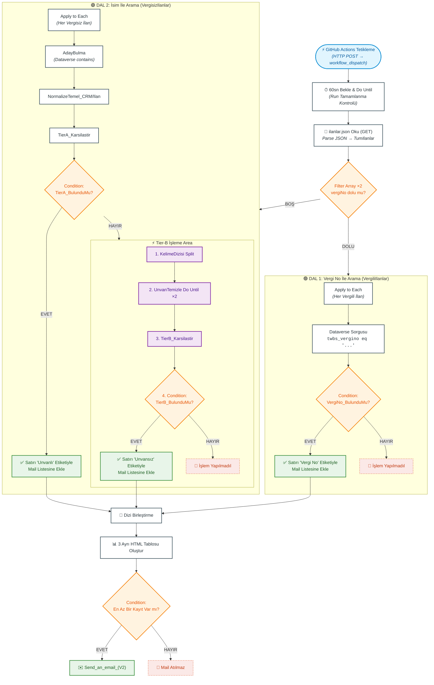

```mermaid
graph TD
    classDef trigger fill:#e1f5fe,stroke:#0288d1,stroke-width:2px,color:#01579b;
    classDef process fill:#ffffff,stroke:#455a64,stroke-width:2px,color:#263238;
    classDef condition fill:#fff3e0,stroke:#f57c00,stroke-width:2px,color:#e65100;
    classDef success fill:#e8f5e9,stroke:#388e3c,stroke-width:2px,color:#1b5e20;
    classDef ignore fill:#fbe9e7,stroke:#d84315,stroke-width:1px,color:#bf360c,stroke-dasharray: 3 3;
    classDef nested fill:#f3e5f5,stroke:#7b1fa2,stroke-width:2px,color:#4a148c;

    START(["⚡ GitHub Actions Tetikleme<br/><i>(HTTP POST → workflow_dispatch)</i>"]):::trigger
    WAIT["⏱ 60sn Bekle & Do Until<br/><i>(Run Tamamlanma Kontrolü)</i>"]:::process
    FETCH["📄 ilanlar.json Oku (GET)<br/><i>Parse JSON → TumIlanlar</i>"]:::process
    SPLIT_FILTER{"Filter Array ×2<br/>vergiNo dolu mu?"}:::condition

    START --> WAIT --> FETCH --> SPLIT_FILTER

    subgraph DAL_1 ["🟢 DAL 1: Vergi No İle Arama (VergiliIlanlar)"]
        V_LOOP["Apply to Each<br/><i>(Her Vergili İlan)</i>"]:::process
        V_DV["Dataverse Sorgusu<br/><code>twbs_vergino eq '...'</code>"]:::process
        V_COND{"Condition:<br/>VergiNo_BulunduMu?"}:::condition
        V_MATCH["✅ Satırı 'Vergi No' Etiketiyle<br/>Mail Listesine Ekle"]:::success
        V_SKIP["🚫 İşlem Yapılmadıl"]:::ignore

        V_LOOP --> V_DV --> V_COND
        V_COND -- EVET --> V_MATCH
        V_COND -- HAYIR --> V_SKIP
    end

    subgraph DAL_2 ["🟣 DAL 2: İsim İle Arama (VergisizIlanlar)"]
        NV_LOOP["Apply to Each<br/><i>(Her Vergisiz İlan)</i>"]:::process
        NV_CANDIDATE["AdayBulma<br/><i>(Dataverse contains)</i>"]:::process
        NV_NORM["NormalizeTemel_CRM/Ilan"]:::process
        NV_TIERA["TierA_Karsilastir"]:::process
        NV_ACOND{"Condition:<br/>TierA_BulunduMu?"}:::condition
        NV_AMATCH["✅ Satırı 'Unvanlı' Etiketiyle<br/>Mail Listesine Ekle"]:::success

        subgraph NESTED ["⚡ Tier-B İşleme Area"]
            NV_SPLIT["1. KelimeDizisi Split"]:::nested
            NV_CLEAN["2. UnvanTemizle Do Until ×2"]:::nested
            NV_TIERB["3. TierB_Karsilastir"]:::nested
            NV_BCOND{"4. Condition:<br/>TierB_BulunduMu?"}:::condition
            NV_BMATCH["✅ Satırı 'Unvansız' Etiketiyle<br/>Mail Listesine Ekle"]:::success
            NV_BSKIP["🚫 İşlem Yapılmadıl"]:::ignore

            NV_SPLIT --> NV_CLEAN --> NV_TIERB --> NV_BCOND
            NV_BCOND -- EVET --> NV_BMATCH
            NV_BCOND -- HAYIR --> NV_BSKIP
        end

        NV_LOOP --> NV_CANDIDATE --> NV_NORM --> NV_TIERA --> NV_ACOND
        NV_ACOND -- EVET --> NV_AMATCH
        NV_ACOND -- HAYIR --> NESTED
    end

    SPLIT_FILTER -- DOLU --> DAL_1
    SPLIT_FILTER -- BOŞ --> DAL_2

    MERGE["🔀 Dizi Birleştirme"]:::process
    BUILD_HTML["📊 3 Ayrı HTML Tablosu Oluştur"]:::process
    CHECK_MAIL{"Condition:<br/>En Az Bir Kayıt Var mı?"}:::condition
    SEND_MAIL["✉️ Send_an_email_(V2)"]:::success
    NO_MAIL["🔕 Mail Atılmaz"]:::ignore

    V_MATCH --> MERGE
    NV_AMATCH --> MERGE
    NV_BMATCH --> MERGE

    MERGE --> BUILD_HTML --> CHECK_MAIL
    CHECK_MAIL -- EVET --> SEND_MAIL
    CHECK_MAIL -- HAYIR --> NO_MAIL
```
```
